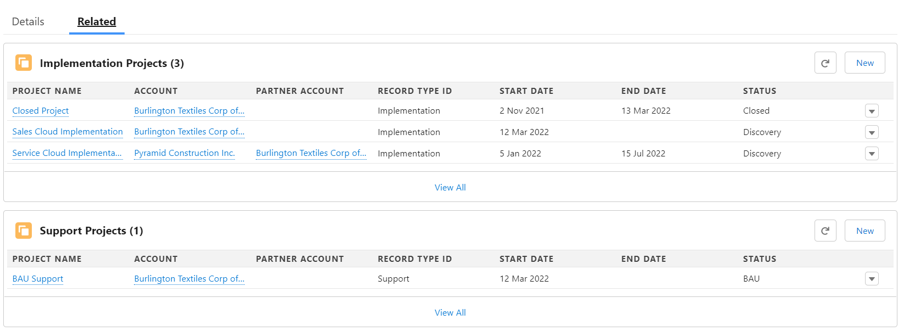
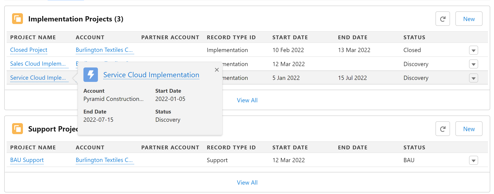

# Related SObject List

A flexible Lightning Web Component for Salesforce that enables you to display related records from any SObject on any record page with advanced filtering and customization options.



## Overview

The Related SObject List component extends beyond the limitations of standard Salesforce related lists, giving administrators and developers full control over how related records are displayed and filtered.

## Key Features

- **Universal SObject Support** — Display related records from any SObject on any parent record page
- **Multi-Relationship Consolidation** — Combine records from multiple lookup/master-detail relationships into a single unified list
- **Record Type Filtering** — Filter displayed records by one or more record types
- **Custom Filter Conditions** — Apply SOQL WHERE clause conditions for advanced filtering
- **Security Aware** — Fully respects field-level security, object permissions, and sharing rules
- **Customizable New Record Behavior** — Configure how new records are created, including default field values and record type selection
- **View All Support** — Provides standard "View All" functionality for browsing large record sets
- **Hover Popovers** — Display compact layout information on record link hover (configurable)
- **Multiple Display Modes** — Support for Table, Tiles, and Board layout views
- **Loading States** — Skeleton loading placeholders for improved user experience
- **Empty States** — Informative empty state messages when no records exist
- **Sorting** — Configure default sort order for displayed records



## Installation

There are two installation options available:

| Installation Option | Description |
| ------------------- | ----------- |
| [Unlocked Package](#option-1-unlocked-package) | Recommended for most users. Install via URL or CLI with easy upgrades. |
| [Unmanaged Source](#option-2-unmanaged-source-from-github) | Deploy directly from GitHub. Best for customization or development. |

### Option 1: Unlocked Package

The unlocked package is the recommended installation method for most users. It allows for easy installation and upgrades.

#### Package Version 1.0.0

<a href="https://login.salesforce.com/packaging/installPackage.apexp?p0=04tJ5000000HGm3IAG">
  
</a>

<a href="https://test.salesforce.com/packaging/installPackage.apexp?p0=04tJ5000000HGm3IAG">
  
</a>

#### CLI Installation

```bash
sf package install --package 04tJ5000000HGm3IAG --target-org <your-org-alias> --wait 10
```

---

### Option 2: Unmanaged Source from GitHub

Deploy the source code directly from GitHub. This option is useful if you need to customize the component or contribute to development.

<a href="https://githubsfdeploy.herokuapp.com/app/githubdeploy/vipultaylor/related-sobject-list">
  
</a>

<a href="https://githubsfdeploy-sandbox.herokuapp.com/app/githubdeploy/vipultaylor/related-sobject-list">
  
</a>

> **Note:** Always test in a sandbox before deploying to production.

## Configuration

The component is configured through Lightning App Builder. Add the **SObject Related List** component to any record page and configure the following properties.

### Required Properties

| Property | Type | Description |
|----------|------|-------------|
| **SObject Name** | String | API name of the related object to display (e.g., `Case`, `Opportunity`, `Custom_Object__c`) |
| **Record Types** | String | Comma-separated list of record type developer names. Use `ALL_RECORDTYPES` to include all record types or if record types are not enabled for the object |
| **Field Set for SObject** | String | Developer name of the field set that defines which columns to display |
| **Relationship Field Names** | String | Comma-separated lookup/master-detail field API names that link records to the parent. Records matching any of these fields will be included |
| **Parent Object Identifier Field Name** | String | The field API name used to identify the parent record. Leave empty to use the current record's Id |

### Display Properties

| Property | Type | Default | Description |
|----------|------|---------|-------------|
| **Title** | String | — | Custom title displayed in the component header |
| **Icon Name** | String | — | SLDS icon name for the component header (e.g., `standard:case`, `custom:custom1`) |
| **Display Type** | Picklist | Table | Layout format: `Table`, `Tiles`, or `Board` |
| **Display Type (View All)** | Picklist | Table | Layout format used when viewing all records |
| **How many records displayed?** | Integer | — | Maximum number of records to display (max 10) |
| **Sort** | String | — | Default sort order using syntax: `FieldApiName ASC` or `FieldApiName DESC` (e.g., `CreatedDate DESC`) |

### Behavior Properties

| Property | Type | Default | Description |
|----------|------|---------|-------------|
| **Show Header** | Boolean | `true` | Display the component header. When disabled, the New button is not available |
| **Hide On No Records?** | Boolean | `true` | Hide the component entirely when no matching records exist |
| **Show New Button?** | Boolean | `true` | Display the New button. Respects object-level create permission |
| **Allow Hover on record Hyperlinks?** | Boolean | `false` | Enable compact layout popover on hovering over record links |
| **Allow Text Wrapping?** | Boolean | `true` | Allow text to wrap in text area fields. When disabled, text is truncated |

### Advanced Properties

| Property | Type | Default | Description |
|----------|------|---------|-------------|
| **Hyperlink Field Names** | String | — | Comma-separated field API names that should render as clickable links to their related records |
| **Additional Query Condition** | String | — | Custom SOQL WHERE clause condition (e.g., `Status = 'Active'`) |
| **Primary Relationship Field Name** | String | — | Field to pre-populate with the parent record Id when creating new records |
| **Z-Index** | Integer | — | CSS z-index value for the component. Required for hover popovers to display correctly above other elements |

### Tiles/Board Layout Properties

| Property | Type | Default | Description |
|----------|------|---------|-------------|
| **Fields displayed (Tiles Layout)** | Integer | `4` | Number of fields to display in Tiles layout |
| **Display First Field Label (Tiles)?** | Boolean | `true` | Show or hide the label for the first field in Tiles layout |
| **Columns (Tiles/Board Layout)** | Integer | `1` | Number of columns for Tiles or Board layout. Accepts values `1`, `2`, or `3` |

## Usage Examples

### Basic Related List
Display Cases related to an Account:
- **SObject Name:** `Case`
- **Record Types:** `ALL_RECORDTYPES`
- **Field Set:** `Case_List_Fields`
- **Relationship Field Names:** `AccountId`

### Filtered by Record Type
Display only "Support" and "Billing" case record types:
- **SObject Name:** `Case`
- **Record Types:** `Support,Billing`
- **Field Set:** `Case_List_Fields`
- **Relationship Field Names:** `AccountId`

### Multiple Relationships
Display Contacts related via either Account or a custom lookup:
- **SObject Name:** `Contact`
- **Record Types:** `ALL_RECORDTYPES`
- **Field Set:** `Contact_Summary`
- **Relationship Field Names:** `AccountId,Related_Account__c`

### With Custom Filter
Display only open, high-priority Cases:
- **SObject Name:** `Case`
- **Record Types:** `ALL_RECORDTYPES`
- **Field Set:** `Case_List_Fields`
- **Relationship Field Names:** `AccountId`
- **Additional Query Condition:** `IsClosed = false AND Priority = 'High'`

## Field Set Configuration

Create a Field Set on your target SObject to define which fields appear as columns:

1. Navigate to **Setup > Object Manager > [Your Object] > Field Sets**
2. Click **New** and provide a name and description
3. Drag fields from the available fields list to the field set
4. Save the field set
5. Use the field set's **API Name** in the component configuration

## Permissions & Security

The component respects Salesforce security at all levels:

- **Object Permissions** — Users must have Read access to the SObject
- **Field-Level Security** — Only fields the user can access are displayed
- **Sharing Rules** — Only records the user has access to are shown
- **Create Permission** — New button only appears if user has Create permission on the object

## Known Issues

Track known issues and report bugs on the [Issues](https://github.com/vipultaylor/Related-SObject-List/issues) page.

## Contributing

Contributions are welcome! Please feel free to submit a pull request or open an issue for bugs or feature requests.

## License

This project is available as unmanaged code. Use at your own discretion and always test thoroughly before deploying to production environments.
